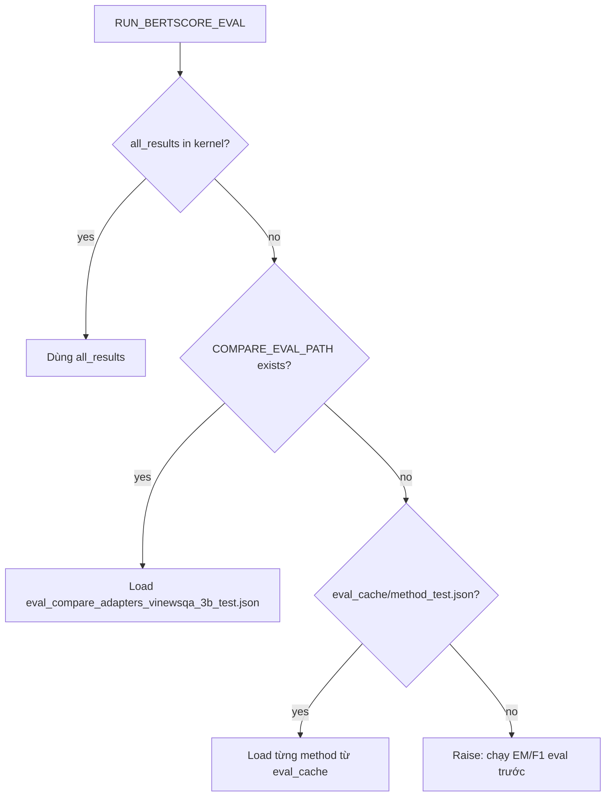

# BERTScore eval cho 4 variant ViNewsQA 3B

## Overview

Thêm cell BERTScore ở cuối notebook 3B LoRA: đo P/R/F1 ngữ nghĩa cho 4 variant, ưu tiên tái sử dụng predictions từ `eval_compare_adapters_vinewsqa_3b_test.json` (hoặc `all_results` / eval_cache), không cần infer lại.

## Mục tiêu

Sau cell EM/F1 hiện có trong [`train_qwen_lora_unsloth_vinewsqa_3b.ipynb`](train_qwen_lora_unsloth_vinewsqa_3b.ipynb), thêm đánh giá **BERTScore** cho `lora` / `tinylora` / `dora` / `delora`, tái sử dụng predictions đã có — **không infer lại**.

## Quyết định mặc định

- Embedding model: **`bert-base-multilingual-cased`** (ổn định cho tiếng Việt, dễ cite trong paper).
- Score mỗi sample: **max BERTScore-F1** trên mọi `gold_answers` (cùng logic EM/Token-F1 hiện tại).
- Aggregate: mean Precision / Recall / F1 × 100.
- Flag: `RUN_BERTSCORE_EVAL = True`.

## Nguồn predictions (thứ tự ưu tiên)



File chính: `COMPARE_EVAL_PATH = "eval_compare_adapters_vinewsqa_3b_test.json"` (đã có `predictions[method][].prediction` + `gold_answers`).

## Thay đổi trong notebook

### 1. Constants (cell config)

Thêm:

```python
RUN_BERTSCORE_EVAL = True
BERTSCORE_MODEL = "bert-base-multilingual-cased"
BERTSCORE_BATCH_SIZE = 64
BERTSCORE_OUT_PATH = "eval_compare_adapters_vinewsqa_3b_test_with_bertscore.json"
```

### 2. Pip install (cell install hoặc cell BERTScore)

```python
!pip install bert-score -q
```

### 3. Cell mới ở **cuối notebook** (sau cell EM/F1)

Logic chính:

1. `load_predictions_for_bertscore()` theo thứ tự trên.
2. Với mỗi method trong `COMPARE_METHODS` có predictions:
   - `cands = [row["prediction"] for row in preds]`
   - Với multi-gold: gọi `bert_score.score` theo từng gold hoặc dùng multi-ref API rồi lấy **max F1 per sample**.
   - Ghi `bertscore_p/r/f1` vào từng prediction row.
   - Aggregate mean → `metrics["bertscore_precision/recall/f1"]`.
3. In bảng:

   `Method | EM | Token-F1 | BERTScore-F1 | Samples`

4. Ghi `BERTSCORE_OUT_PATH` (và merge BERTScore vào summary của compare JSON nếu file gốc tồn tại).
5. Dùng `device="cuda"` nếu có GPU; bỏ `lang` khi chỉ định `model_type` tường minh.

### 4. Không đụng

- Không sửa subprocess infer.
- Không bắt buộc retrain.
- EM/F1 cell giữ nguyên; BERTScore cell độc lập để chạy riêng khi đã có `eval_compare_*.json`.

## Output kỳ vọng

```
Method       EM%      Token-F1%   BERTScore-F1%   Samples
lora         ...      ...         ...             1987
tinylora     ...
dora         ...
delora       ...
Saved -> eval_compare_adapters_vinewsqa_3b_test_with_bertscore.json
```

## Cách chạy trên remote

1. Sync notebook.
2. Nếu đã có `eval_compare_adapters_vinewsqa_3b_test.json`: chỉ cần chạy cell constants + cell BERTScore (không cần infer).
3. Nếu chưa có: chạy cell EM/F1 trước (`RUN_METRIC_EVAL=True`), rồi cell BERTScore.

## Implementation todos

- [ ] Thêm `RUN_BERTSCORE_EVAL` / `BERTSCORE_MODEL` / paths vào cell constants
- [ ] Thêm cell cuối: load predictions từ `all_results` / COMPARE JSON / cache, tính BERTScore max-over-golds, in bảng, lưu JSON
- [ ] Thêm `pip install bert-score` vào install hoặc cell BERTScore
